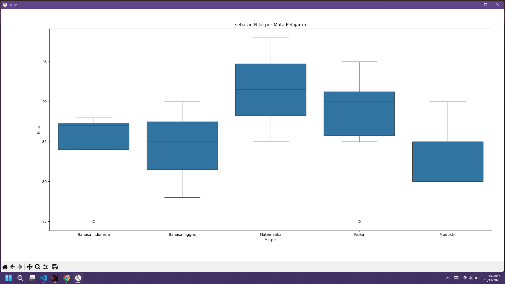

# Analisis Nilai Siswa — Laporan Sangat Lengkap dan Mendalam

Dokumen ini berisi analisis mendetail mengenai performa siswa berdasarkan nilai setiap mata pelajaran.  
Analisis dilakukan menggunakan Python, Pandas, Seaborn, dan Matplotlib.  
Laporan ini memuat penjelasan mendalam mengenai distribusi nilai, rata-rata per mata pelajaran, variasi performa siswa, hingga rekomendasi pembelajaran berbasis data.

---

# 1. Grafik Rata-rata Nilai Siswa per Mata Pelajaran
Visualisasi ini menunjukkan nilai rata-rata siswa pada tiap mata pelajaran dan membantu melihat mana pelajaran yang memiliki performa paling kuat atau paling lemah.


## Interpretasi:
- **Matematika** memiliki rata-rata tertinggi → siswa unggul dalam logika & numerik.
- **Fisika** juga tinggi → pemahaman sains siswa cukup kuat.
- **Bahasa Indonesia** dan **Produktif** stabil dengan nilai cukup tinggi.
- **Bahasa Inggris** memiliki rata-rata paling rendah → potensi kesulitan siswa dalam grammar/vocabulary.

---

# 2. Boxplot Sebaran Nilai per Mata Pelajaran
Grafik ini menunjukkan penyebaran nilai, median, IQR, variasi performa siswa, dan outlier.



## Interpretasi Mendalam per Pelajaran:

### 📘 Bahasa Indonesia
- Median tinggi → mayoritas siswa mendapat nilai baik.
- Ada satu outlier rendah (75) → perlu perhatian khusus.
- IQR sempit → kemampuan siswa merata.

### 📙 Bahasa Inggris
- IQR lebih lebar → kemampuan siswa tidak merata.
- Median lebih rendah dibanding mata pelajaran lain.
- Perlu penguatan dalam speaking, listening, grammar.

### 📐 Matematika
- Median paling tinggi → performa siswa sangat baik.
- IQR kecil → kemampuan cukup merata.
- Nilai tertinggi seluruh dataset (98) ada di pelajaran ini.

### 🔬 Fisika
- Median tinggi dan distribusi baik.
- Ada outlier rendah → mungkin kesulitan pada konsep tertentu.
- Variasi nilai sedikit lebih lebar dari Matematika.

### 🛠 Produktif
- Variasi nilai besar → kemampuan siswa tidak merata.
- Median berada pada nilai tengah.
- Karena berbasis praktik, wajar jika hasil berbeda-beda.

---

# 3. Tujuan Analisis
Analisis ini dilakukan untuk:
- Melihat pola performa siswa.
- Menemukan mata pelajaran yang perlu perhatian khusus.
- Mengetahui penyebaran nilai secara visual dan statistik.
- Memberikan rekomendasi pembelajaran berdasarkan data.

---

# 4. Statistik Dasar (Mean, Median, Mode)
Statistik ini penting untuk memahami pusat data dan kecenderungan nilai.

- **Mean**: Menggambarkan nilai rata-rata keseluruhan.
- **Median**: Menunjukkan nilai tengah yang stabil dari pengaruh outlier.
- **Modus**: Nilai yang paling sering muncul → menggambarkan tren umum.

---

# 5. Rekomendasi Berdasarkan Data

### 📘 Bahasa Indonesia
- Fokuskan remedial pada siswa outlier.
- Tingkatkan pembelajaran membaca dan analisis teks.

### 📙 Bahasa Inggris
- Tambahkan program latihan vocabulary & listening.
- Terapkan metode interaktif seperti games, dialog, video.

### 📐 Matematika
- Pertahankan metode mengajar karena performa sangat bagus.
- Berikan soal pemecahan masalah tingkat lanjut.

### 🔬 Fisika
- Tambahkan praktikum untuk memperkuat pemahaman konsep.
- Berikan pendampingan untuk siswa dengan nilai rendah.

### 🛠 Produktif
- Pembelajaran berbasis proyek (project-based learning) akan efektif.
- Berikan latihan bertahap untuk siswa dengan kemampuan rendah.

---

# 6. Penjelasan Kode Python Singkat

```python
data = pd.read_csv('nilai_siswa.csv')
data['Nilai'].mean()
data['Nilai'].median()
data['Nilai'].mode()[0]
data.groupby('Matpel')['Nilai'].mean()

rata.plot(kind='bar')
sns.boxplot(x='Matpel', y='Nilai', data=data)
```

Kode di atas mencakup:
- Pembacaan dataset
- Perhitungan statistik dasar
- Pengelompokan berdasarkan mata pelajaran
- Pembuatan grafik batang dan boxplot

---

# 7. Kesimpulan Utama
- Mata pelajaran **Matematika** dan **Fisika** memiliki performa tertinggi.
- **Bahasa Inggris** membutuhkan perhatian dan penguatan pembelajaran.
- Terdapat outlier pada Bahasa Indonesia & Fisika yang perlu dibina.
- Variasi terbesar ada di **Produktif**, wajar karena berbasis keterampilan praktik.

---

# 8. Lisensi
Dokumen ini bebas digunakan untuk edukasi, laporan, dan keperluan analisis.

